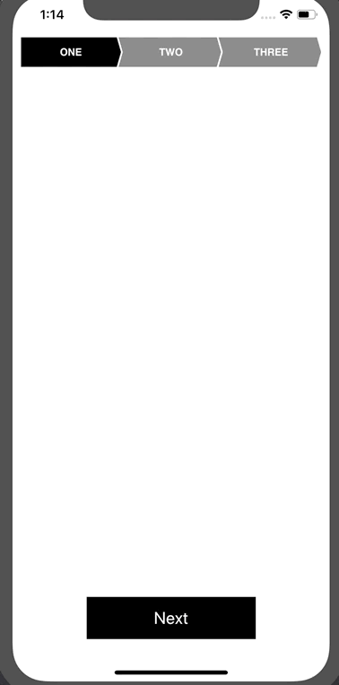

# BreadCrumbHeaders



## Example

To run the example project, clone the repo, and run `pod install` from the Example directory first.

## Requirements

## Installation

### Swift Package Manager

StagLayout is now available as a Swift package.

### Cocoapods

BreadCrumbHeaders is available through [CocoaPods](https://cocoapods.org). To install
it, simply add the following line to your Podfile:

```ruby
pod 'BreadCrumbHeaders'
```

## Author

Inder Dhir, inderdhir@hotmail.com

## License

BreadCrumbHeaders is available under the MIT license. See the LICENSE file for more info.
